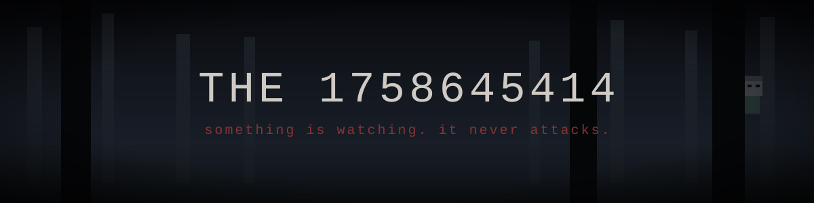
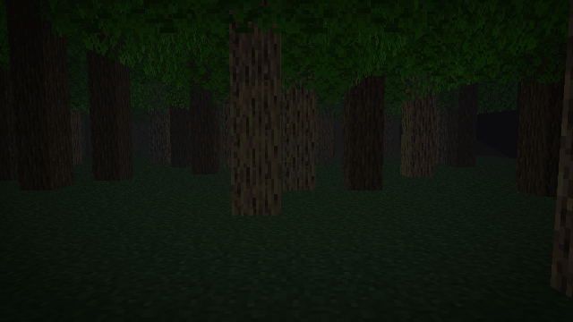
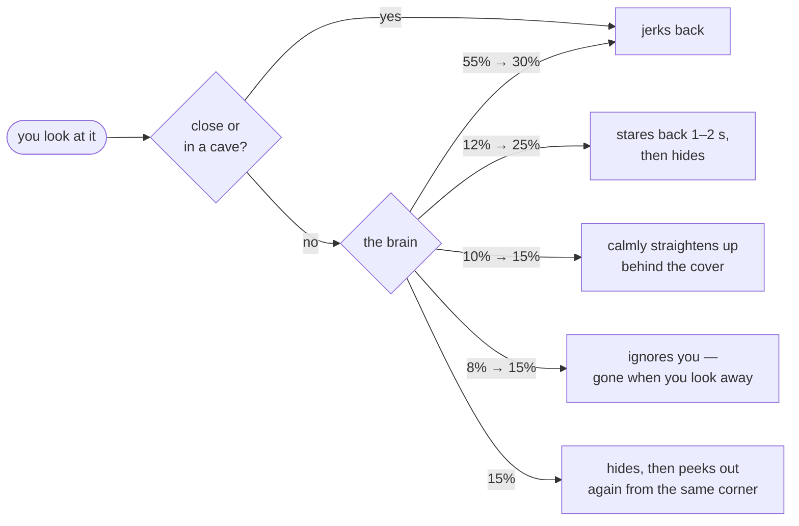
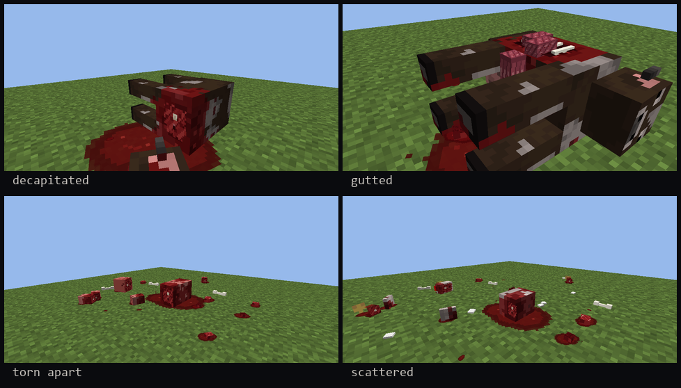

<div align="center">



[](https://github.com/ThompsonCBB/the-onlooker/releases/latest)


**A quiet horror mod. No jumpscares, no monsters, no damage.**<br>
Just something standing behind the trees, a little closer every time.

<br>



<sub>Real pose code of the mod, rendered offline by <a href="tools/animsim">the simulator</a>. In-game lighting differs.</sub>

<br><br>

[**Download**](https://github.com/ThompsonCBB/the-onlooker/releases/latest) &nbsp;·&nbsp;
[What to expect](#-what-to-expect) &nbsp;·&nbsp;
[Is my world safe?](#-is-my-world-safe) &nbsp;·&nbsp;
[Config](#%EF%B8%8F-config) &nbsp;·&nbsp;
[History](#-history) &nbsp;·&nbsp;
[По-русски](#-по-русски)

</div>

---

## 👁 What to expect

> You will not be told much. That is the point.

<table>
<tr>
<td width="25%" valign="top">

### 🌲 It watches
It leans out from behind cover and looks at you. It is never in front of you when it comes, and it never vanishes while you can see it.

</td>
<td width="25%" valign="top">

### 🧠 It learns
It does not always run. The more often you catch it, the bolder it gets. You will not learn what it does next.

</td>
<td width="25%" valign="top">

### 🕯 Caves
Torches you did not place. Someone's camp. A corner it is waiting behind.

</td>
<td width="25%" valign="top">

### 🌫 Some days
Some days are wrong. You will know when it happens.

</td>
</tr>
</table>

It has no attack, no hitbox and no drops. You cannot fight it. You can only stop looking.

<details>
<summary><b>🧠 How it thinks</b> &nbsp;<sub>(spoilers)</sub></summary>
<br>

Every time you look it in the face, it picks a reaction. Weights shift as you notice it more, and an unusual reaction never repeats twice in a row.



<sub>Percentages: first sightings → after 8 sightings. Details in <a href="docs/DIRECTOR.md"><code>docs/DIRECTOR.md</code></a>.</sub>

</details>

<details>
<summary><b>🩸 Forests</b> &nbsp;<sub>(blocky gore)</sub></summary>
<br>

Now and then something kills a farm animal behind your back, among the trees. You hear steps. You turn around. You find what is left.



Minecraft-style cubes, no realistic textures. Decoration only. Switch off with `forest.deadAnimals = false`.

</details>

## 📦 Install

1. Install [Forge](https://files.minecraftforge.net/net/minecraftforge/forge/index_1.20.1.html) for **Minecraft 1.20.1** (47.x).
2. Download the jar from [**Releases**](https://github.com/ThompsonCBB/the-onlooker/releases/latest).
3. Drop it into `.minecraft/mods`.

Works in singleplayer and on servers (needed on both sides).

## 🛡 Is my world safe?

| | What happens |
|---|---|
| **Your builds** | Never broken or replaced. New blocks only go into empty air in natural caves. |
| **Your mobs and villagers** | Can be gone for a day. They come back exactly as they were, trades included. |
| **Servers** | Each player has their own watcher, invisible to others. Anything that changes the shared world is **off by default**. |
| **Performance** | Searches are capped at 20 ms and never load or generate chunks. |
| **Privacy** | Reads nothing from your computer, sends nothing anywhere. |
| **Sound** | Only footsteps and rustles behind you in forests. |

## ⚙️ Config

`config/theonlooker-common.toml` — every feature can be switched off or tuned.

<details>
<summary>Most useful settings</summary>

```toml
[general]
worldChangesInMultiplayer = false   # allow world-changing events on servers

[director]
graceSeconds = 180                  # quiet time after joining a world
intervalMinSeconds = 120
intervalMaxSeconds = 240
notInDaylight = false               # true = never by day

[look]
variedReactions = true              # false = it always just hides

[forest]
deadAnimals = true
soundsBehind = true

[events]
deadWorld = true
emptyVillage = true
finale = true
```

</details>

<details>
<summary>Commands (operators, for testing)</summary>

| Command | |
|---|---|
| `/anta debug on\|off` | debug messages in chat |
| `/anta test any` | spawn it behind the nearest cover |
| `/anta director now\|off\|on` | next natural appearance / switch off |
| `/anta react snap\|stare\|slow\|wait\|return\|random` | force a reaction |
| `/anta carcass <animal> <style>` | dead animal in front of you |
| `/anta clear` | remove it |

Full list: [`docs/TESTING.md`](docs/TESTING.md). Test plan: [`docs/TEST_PLAN.md`](docs/TEST_PLAN.md).

</details>

## ❓ FAQ

<details><summary><b>Does it ever attack or hurt me?</b></summary><br>No. It never touches you, never blocks you, never deals damage.</details>
<details><summary><b>Can I kill it?</b></summary><br>No. Arrows and blocks pass through it. Looking at it is the only thing that works, and not always.</details>
<details><summary><b>It is too often / too rare.</b></summary><br><code>director.intervalMinSeconds</code> and <code>intervalMaxSeconds</code> in the config.</details>
<details><summary><b>Fabric? 1.21?</b></summary><br>Forge 1.20.1 only for now.</details>
<details><summary><b>Who is the Onlooker?</b></summary><br>Nobody knows. It only watches.</details>

## 🔧 Under the hood

Every animation and every dead animal goes through an **offline simulator** before release: it runs the mod's own pose and layout code (`com.anta.anim`) and renders frames from the player's eyes, so the result is checked by looking at it, not by guessing.

```powershell
./gradlew build                                # jar in build/libs (JDK 17)
powershell -File tools/animsim/sim.ps1 hide    # watcher animation → frames + gif
powershell -File tools/animsim/sim_carcass.ps1 # dead animals, all styles and angles
python tools/animsim/hero.py                   # the gif at the top of this page
```

Design notes live in [`docs/`](docs): [`DIRECTOR.md`](docs/DIRECTOR.md) · [`COVER_SYSTEM.md`](docs/COVER_SYSTEM.md) · [`EVENTS.md`](docs/EVENTS.md) · [`CAVE_TRACES.md`](docs/CAVE_TRACES.md) · [`DECISIONS.md`](docs/DECISIONS.md)

## 📜 History

Every build is on the [Releases](https://github.com/ThompsonCBB/the-onlooker/releases) page, 20 versions from the very first one. Before 4.0.0 the mod was called **Anta**.

| Version | |
|---|---|
| **4.7** | Smoother hiding; it never disappears in front of you and is easier to catch |
| **4.3 – 4.6** | Forests: dead animals, steps behind you, carcass simulator |
| **4.2** | The brain: five ways to react to your gaze |
| **4.1** | No contact with the player at all; things vanish for one day, then return |
| **4.0** | Full code review |
| **3.3 – 3.6** | Caves: ambush around the corner, strangers' torches and camps, events |
| **3.0** | The director: it comes by itself, always where you are not looking |
| **2.0** | It hides when you look at it |
| **1.0** | A figure behind cover |

Full changelog (in Russian): [`docs/CHANGELOG.md`](docs/CHANGELOG.md).

## 🇷🇺 По-русски

<details>
<summary>Описание</summary>
<br>

**The Onlooker** — тихий хоррор-мод для Minecraft Forge 1.20.1. Что-то стоит за деревьями и углами и выглядывает. Посмотрите на него — спрячется. Не всегда сразу. Оно не нападает, его нельзя ударить, и оно никогда не исчезает у вас на глазах.

Мод меняет мир: в пещерах остаются чужие следы, а то, что пропадает, возвращается ровно через игровой день. На серверах изменения общего мира по умолчанию выключены. Всё настраивается в `config/theonlooker-common.toml`.

Установка: Forge 1.20.1 → jar из [Releases](https://github.com/ThompsonCBB/the-onlooker/releases/latest) → папка `mods`.

</details>

---

<div align="center">
<sub>Code written with an AI assistant (Kiro), directed by the author · All Rights Reserved, see <a href="LICENSE.txt">LICENSE.txt</a></sub>
</div>
