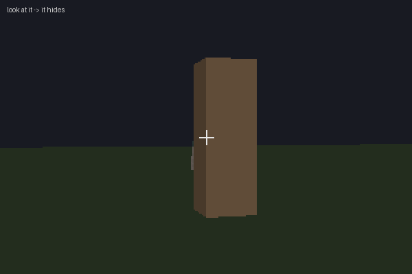
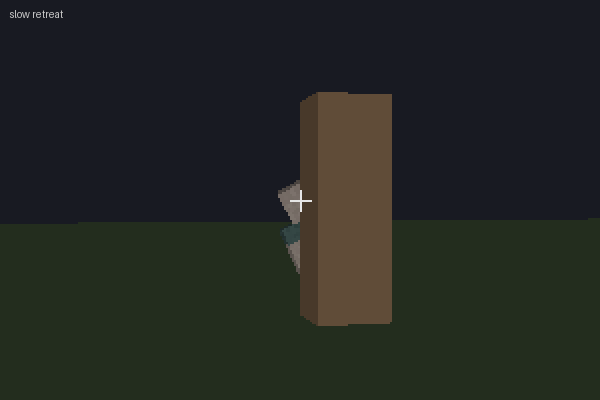
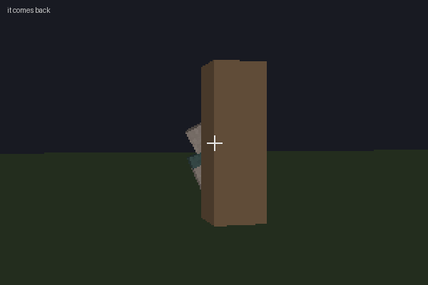
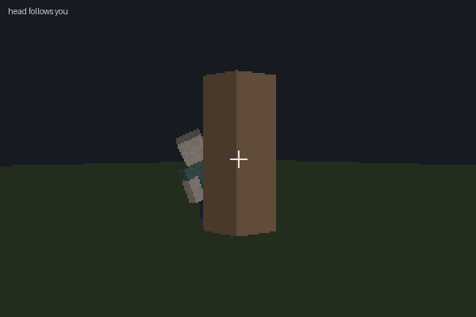
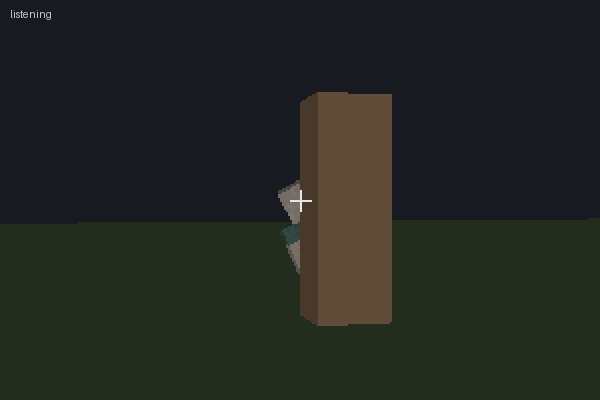
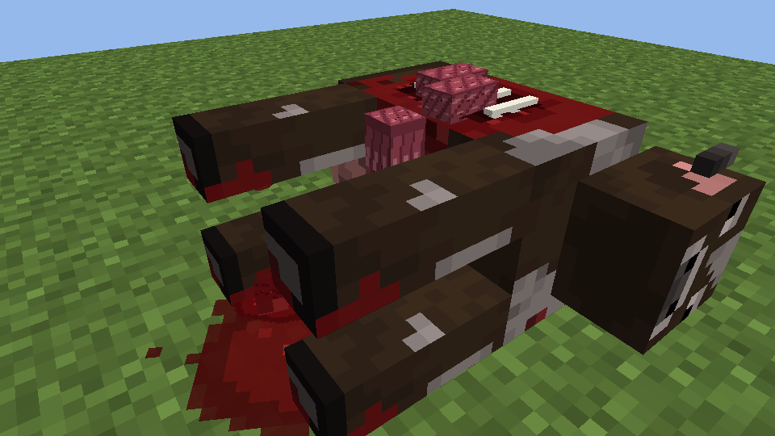
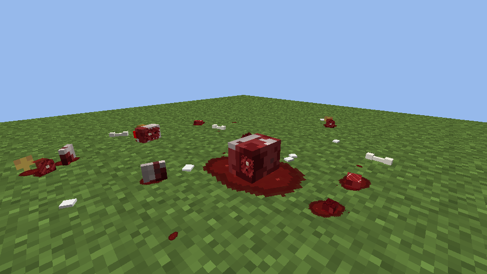

<div align="center">

# The 1758645414

**Something is watching. It never attacks.**

A quiet horror mod for Minecraft Forge 1.20.1




</div>

---

## What it does

It stands behind trees, corners and cave walls and leans out to look at you. Look back, and it hides.

It has no attack, no hitbox, no loot. It is never in front of you when it comes, and it never disappears while you are looking at it. The rest is for you to find out.

| | |
|---|---|
|  |  |
| **It does not always run.** Sometimes it holds your gaze, sometimes it calmly straightens up behind the cover. | **Sometimes it comes back.** A few seconds later it peeks out from the same corner. |
|  |  |
| **The head follows you**, a moment late. | **It listens.** |

### Forests

Now and then a dead farm animal turns up among the trees, and you hear footsteps behind you. Blocky Minecraft-style gore, decoration only, can be switched off.

| | |
|---|---|
|  |  |

> Frames above are from the offline simulators in [`tools/animsim`](tools/animsim), which render the mod's own pose and layout code. In-game lighting differs.

## Install

1. Install [Minecraft Forge](https://files.minecraftforge.net/net/minecraftforge/forge/index_1.20.1.html) for **1.20.1** (47.x).
2. Download the jar from [Releases](https://github.com/ThompsonCBB/the-1758645414/releases/latest).
3. Put it into `.minecraft/mods`.

Client and server. On a dedicated server it is needed on both sides.

## Good to know

- **The mod changes the world.** Cave traces (torches, a chest, a furnace) stay. Some events take something away for **one in-game day** and give it back exactly as it was. Nothing is lost for good.
- **Multiplayer:** every player has their own watcher, invisible to others. Events that change the shared world are off on servers by default (`worldChangesInMultiplayer`).
- **Sounds:** the only sounds are footsteps and rustles behind you in forests.
- **Privacy:** the mod reads nothing from your computer and sends nothing anywhere.
- **Settings:** `config/the1758645414-common.toml` — every feature can be switched off or tuned.

## Commands

All commands need operator rights (cheats on). Mod id is `anta`.

| Command | |
|---|---|
| `/anta debug on\|off` | debug messages in chat |
| `/anta test any` | spawn it behind the nearest cover |
| `/anta director now\|off\|on` | next natural appearance / switch off |
| `/anta react snap\|stare\|slow\|wait\|return\|random` | force a reaction |
| `/anta carcass <animal> <style>` | dead animal in front of you |
| `/anta clear` | remove it |

Full list and test plan: [`docs/TESTING.md`](docs/TESTING.md), [`docs/TEST_PLAN.md`](docs/TEST_PLAN.md).

## Building

Requires JDK 17.

```powershell
./gradlew build                              # jar in build/libs
powershell -File tools/release.ps1 -LowMemory  # build + copy jar and changelog
powershell -File tools/animsim/sim.ps1 hide    # animation simulator (frames + gif)
```

Project docs live in [`docs/`](docs): design ([`DIRECTOR.md`](docs/DIRECTOR.md), [`COVER_SYSTEM.md`](docs/COVER_SYSTEM.md), [`EVENTS.md`](docs/EVENTS.md)), decisions ([`DECISIONS.md`](docs/DECISIONS.md)) and the full history ([`CHANGELOG.md`](docs/CHANGELOG.md), in Russian).

## Versions

Every build is published under [Releases](https://github.com/ThompsonCBB/the-1758645414/releases), from 1.0.0 to the latest. Versions before 4.0.0 were released as **Anta**.

## Credits

Code written with an AI assistant (Kiro), directed and tested by the author.

All Rights Reserved. See [`LICENSE.txt`](LICENSE.txt).

---

<details>
<summary><b>По-русски</b></summary>

**The 1758645414** — тихий хоррор-мод для Minecraft Forge 1.20.1. Что-то выглядывает из-за деревьев, углов и стен пещер. Посмотрите на него — оно спрячется. Оно не нападает, его нельзя ударить, и оно никогда не исчезает у вас на глазах.

Иногда в лесу попадаются мёртвые животные, а позади слышны шаги. Мод меняет мир: следы в пещерах остаются, а то, что пропадает, возвращается ровно через игровой день. На серверах изменения общего мира по умолчанию выключены. Все функции настраиваются в `config/the1758645414-common.toml`.

Установка: Forge 1.20.1, jar из [Releases](https://github.com/ThompsonCBB/the-1758645414/releases/latest) в папку `mods`. История изменений — [`docs/CHANGELOG.md`](docs/CHANGELOG.md).

</details>
